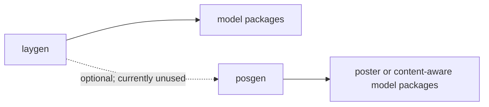

# Shared library architecture

The repository keeps reusable layout and poster-generation code in shared workspace libraries, while model packages keep model-specific behavior local.

## Workspace layout

A workspace member is a package included in the root `uv` workspace, so contributors can develop it alongside the model packages that consume it.

The workspace contains shared libraries under `lib/*` and model packages under `models/*`.

```text
lib/
  laygen/
  posgen/
  traingen/
  traingen-parity/
models/
  <model-package>/
```

The root workspace declaration is:

```toml
[tool.uv.workspace]
members = ["lib/*", "models/*"]
```

The `lib/` and `models/` directories are separate ownership boundaries: shared libraries provide reusable contracts and helpers, while a model package owns its model-specific processing, inference, conversion, training, and configuration code.

## Dependency environments

A member-scoped environment installs one selected workspace package with `uv sync --package <name>` and is the environment used by the member test matrix for package-local development and verification. Member environments resolve package dependencies through the workspace source mappings.

A root-tooling environment installs the root package and its tooling group with `uv sync --package design-generators --group dev`, and evaluation-only commands add the root `evaluation` extra when they run `scripts/verify_evaluate_layout_metrics.py`. The root project installs no runtime dependencies by default; its `[tool.uv].constraint-dependencies` entry keeps workspace members on the tier-1 `transformers>=5.0.0` and `diffusers>=0.36.0` version ranges, while members declare the extras they install.

| Surface                           | Decision                                                                        | Owner                                  | Concrete consumer / contract                                                                            | Rationale                                                                                                             |
| --------------------------------- | ------------------------------------------------------------------------------- | -------------------------------------- | ------------------------------------------------------------------------------------------------------- | --------------------------------------------------------------------------------------------------------------------- |
| Base `transformers[torch,vision]` | Remove the root install; retain `transformers>=5.0.0` as a workspace constraint | Root version policy; members runtime   | Root `[tool.uv].constraint-dependencies`; member `pyproject.toml` files declare the extras they install | The root coordinates one tier-1 version range without installing runtime packages into root tooling environments.     |
| `evaluation` extra                | Keep                                                                            | Root verifier                          | `scripts/verify_evaluate_layout_metrics.py` and its `evaluate.load` metrics                             | The verifier is root-owned; `layout-unreadability` imports `cv2`, so `opencv-python` remains explicit.                |
| `training` extra                  | Remove from root                                                                | Training-enabled members               | Member-scoped `--extra training` workflows and `tests/test_training_import_contract.py`                 | Training dependencies are selected in each member environment after the package-scoped import contract.               |
| `llm-agent` extra                 | Remove from root                                                                | Agent-enabled members                  | `laygen[agents]` and member package metadata                                                            | Agent dependencies belong to agent-capable packages, not the tooling coordinator.                                     |
| `diffusion` extra                 | Remove from root; retain `diffusers>=0.36.0` as a workspace constraint          | Root version policy; diffusion members | Root `[tool.uv].constraint-dependencies`; member `diffusers[torch]` declarations                        | The root fixes the tier-1 range without installing Diffusers or its extras; model packages own Diffusers runtime use. |
| `download` extra                  | Remove from root                                                                | Download-enabled members               | Package-local download extras, including `models/ralf`                                                  | Download dependencies are specific to each asset workflow; the RALF error names its package extra.                    |
| `dev` group                       | Keep                                                                            | Root tooling                           | Root checks, tests, and pre-commit commands                                                             | Repository-wide development tooling remains root-owned.                                                               |
| `docs` group                      | Keep                                                                            | Root tooling                           | `make setup` (`uv sync --all-packages --group docs`)                                                    | Documentation generation remains a repository-wide root workflow.                                                     |

A full-workspace environment installs all workspace members with `uv sync --all-packages` and is retained as an explicit compatibility check for cross-member development and CI. Add `--group docs` when preparing the full checkout for documentation work, as in `make setup`.

These contracts are implemented in [Issue #345](https://github.com/creative-graphic-design/design-generators/issues/345). The root coordinates tooling and version policy, while workspace members own their runtime dependencies.

## Shared package names and imports

`laygen` is the shared layout-generation library; its installable package name and its import name are both `laygen`. `posgen` is the shared poster and content-aware library; its installable package name and its import name are both `posgen`.

Use `laygen.common` for helpers that are reusable across layout-generation packages, and use `posgen.common` for helpers that are reusable across poster or content-aware packages.

## Ownership boundaries

| Concern                                                                                                             | Shared owner            | Model-package responsibility                                                                                                           |
| ------------------------------------------------------------------------------------------------------------------- | ----------------------- | -------------------------------------------------------------------------------------------------------------------------------------- |
| Layout boxes, labels, discrete helpers, visualization, serialization, testing, and other proven layout-wide helpers | `laygen.common`         | Apply model-specific coordinate conventions, token order, checkpoint details, and parity behavior.                                     |
| Poster content, poster labels, poster testing, and poster visualization that are shared by concrete consumers       | `posgen.common`         | Keep model-specific image processing, saliency behavior, retrieval, prompt parsing, tokenization, scheduling, and configuration local. |
| Public output types and pipeline contracts                                                                          | `laygen` public modules | Return the repository's common schema while preserving model-specific optional data in the documented fields.                          |

Move a helper into a shared package when at least two packages need the same behavior or when a shared public contract must exist before a second consumer lands. Do not create a speculative abstraction without concrete shared behavior.

## Dependency direction

All model packages may import `laygen` directly. Poster or content-aware model packages may additionally import `posgen`; `posgen` may depend on `laygen` when shared layout primitives are needed, but the current `posgen` package does not. Shared libraries never import model packages.

`laygen` must not import `posgen` or model packages, and `posgen` must not import model packages.

The Transformers-side shared layout output in `laygen.modeling_outputs` is based on `transformers.utils.ModelOutput`, not `diffusers.utils.BaseOutput`. The Diffusers-side output in `laygen.pipelines.pipeline_output` may use the Diffusers base type behind the optional `diffusion` extra. The `laygen` core dependencies must not gain a hard `diffusers` dependency.



The arrows point from a library to the packages that import it.

`posgen` is a workspace member, and current poster/content-aware consumers use it alongside `laygen`.

## Working with the architecture

Import shared helpers using their public module paths, such as `from laygen.common.bbox import normalize_boxes` or `from posgen.common import PositionContent`.

Keep model-specific code in the model package even when it resembles a shared helper, and add a shared helper only when its behavior and ownership are clear to its consumers.

This page defines where packages live, which package owns each import name, dependency direction, and output dependency boundaries; the current public output fields and pipeline contracts remain documented in [Conventions](conventions/), and API details remain in the generated reference.
