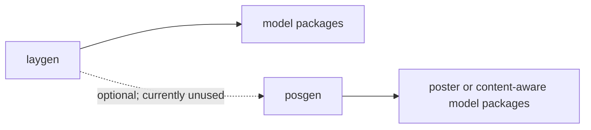

# Shared library architecture

The repository keeps reusable layout and poster-generation code in shared workspace libraries, while model packages keep model-specific behavior local.

## Workspace layout

A workspace member is a package included in the root `uv` workspace, so contributors can develop it alongside the model packages that consume it.

The workspace contains shared libraries under `lib/*` and model packages under `models/*`.

```text
lib/
  laygen/
  posgen/
  traingen/
  traingen-parity/
models/
  <model-package>/
```

The root workspace declaration is:

```toml
[tool.uv.workspace]
members = ["lib/*", "models/*"]
```

The `lib/` and `models/` directories are separate ownership boundaries: shared libraries provide reusable contracts and helpers, while a model package owns its model-specific processing, inference, conversion, training, and configuration code.

## Dependency environments

A member-scoped environment installs one selected workspace package with `uv sync --package <name>` and is the environment used by the member test matrix for package-local development and verification. Member environments resolve package dependencies through the workspace source mappings.

A root-tooling environment installs the root package and its tooling group with `uv sync --package design-generators --group dev`, and evaluation-only commands add the root `evaluation` extra when they run `scripts/verify_evaluate_layout_metrics.py`. The root project installs no runtime dependencies by default; it owns the workspace-wide `transformers` and `diffusers` version floors and the `dev` and `docs` tooling groups, while workspace members own their runtime dependencies.

| Surface                  | Owner                                    | Consumer or contract                                                                                      | Why root owns it                                                                                                        |
| ------------------------ | ---------------------------------------- | --------------------------------------------------------------------------------------------------------- | ----------------------------------------------------------------------------------------------------------------------- |
| Workspace version policy | Root `[tool.uv].constraint-dependencies` | `transformers>=5.0.0` and `diffusers>=0.36.0`; members declare what they install and satisfy these ranges | The root coordinates workspace-wide `transformers` and `diffusers` versions without installing runtime packages itself. |
| `evaluation` extra       | Root verifier                            | `scripts/verify_evaluate_layout_metrics.py` and its `evaluate.load` metrics                               | The verifier is root-owned, and its metrics require the evaluation runtime including explicit `opencv-python`.          |
| `dev` group              | Root tooling                             | Root checks, tests, and pre-commit commands                                                               | Repository-wide development tooling is coordinated at the root.                                                         |
| `docs` group             | Root tooling                             | `make setup` (`uv sync --all-packages --group docs`)                                                      | Documentation generation is a repository-wide root workflow.                                                            |

A full-workspace environment installs all workspace members with `uv sync --all-packages` and serves as an explicit compatibility check for cross-member development and CI. Add `--group docs` when preparing the full checkout for documentation work, as in `make setup`.

## Training ownership

Training infrastructure follows the current package boundaries below. Model packages retain dataset, numerical, scheduling, configuration, and model-specific parity behavior.

| Concern                                                | Current owner              | Notes                                                                                                                             |
| ------------------------------------------------------ | -------------------------- | --------------------------------------------------------------------------------------------------------------------------------- |
| LightningCLI/bootstrap                                 | `traingen`                 | Model-agnostic repository training entrypoint used by package-scoped training environments.                                       |
| Generic Lightning logging/reduction helpers            | `traingen.lightning.steps` | Model-agnostic logging, loss reduction, and training-trace helpers used by package-scoped training environments.                  |
| RNG capture/restore and deterministic runtime controls | `traingen-parity`          | Parity-only primitives are used by LayoutDM, LayoutFlow, and LayoutDiffusion adapters; model-specific seed wrappers remain local. |
| Trace construction/comparison/report helpers           | `traingen-parity`          | Generic parity primitives; model packages provide trace schemas and adapter functions.                                            |
| Model-specific trace point names                       | Model package              | Each package owns its trace tuple; trace names are not shared merely for reuse.                                                   |
| Dataset/data transforms                                | Model package              | Dataset formats, preprocessing, ordering, and loader behavior remain package-specific.                                            |
| Loss definitions                                       | Model package              | Loss formulas and reduction semantics remain package-specific.                                                                    |
| Scheduler/sampler policy                               | Model package              | Optimizer cadence, timestep sampling, EMA, and scheduler behavior remain package-specific.                                        |
| Training YAML/config values                            | Model package              | Dataset and model configuration values live with each package's training entrypoints.                                             |
| Model-specific callbacks                               | Model package              | Callbacks remain local unless at least two concrete consumers have identical behavior.                                            |
| Checkpoint conversion                                  | Model package              | Conversion code follows each model's checkpoint and topology contract.                                                            |

The generated API exposes these helpers under `traingen.lightning.steps`.

## Runtime contract ownership

Shared runtime extraction requires identical semantics in at least two concrete consumers and a clearer shared owner. Model packages keep defaults, aliases, supported sets, error contracts, device resolution, and token-space geometry when those semantics are package-specific.

| Concern                                 | Current shared owner                                                                                                                         | Package-local responsibility                                                                                              | Ownership status                                                                                                                                                                |
| --------------------------------------- | -------------------------------------------------------------------------------------------------------------------------------------------- | ------------------------------------------------------------------------------------------------------------------------- | ------------------------------------------------------------------------------------------------------------------------------------------------------------------------------- |
| Canonical condition vocabulary          | `laygen.common.conditions.ConditionType`                                                                                                     | None                                                                                                                      | Shared now: canonical condition names.                                                                                                                                          |
| Canonical condition aliases             | `laygen.common.conditions.normalize_condition_type`                                                                                          | None                                                                                                                      | Shared now: repository-wide aliases and unknown-condition errors.                                                                                                               |
| Vendor and model condition aliases      | `laygen.common.conditions.normalize_condition_type` provides the canonical layer                                                             | Model package pipeline or processor normalizers provide vendor aliases and alias reinterpretation.                        | Shared now: canonical aliases. Package-owned: vendor aliases and reinterpretations such as CGB-DM's `uncond` meaning `content_image`.                                           |
| Default condition for `None`            | No single shared default                                                                                                                     | Model package pipeline or processor normalizers select the model default.                                                 | Shared now: no default. Package-owned: defaults such as `content_image`, `unconditional`, or `relation`.                                                                        |
| Supported-condition validation          | No single shared supported set                                                                                                               | Model package pipeline or processor validates its supported conditions.                                                   | Shared now: canonical vocabulary. Package-owned: supported sets and their errors.                                                                                               |
| Required condition inputs               | No single shared payload contract                                                                                                            | Model package pipeline or processor validates inputs required by each condition.                                          | Shared now: none beyond canonical argument names. Package-owned: required images, text, boxes, labels, graphs, and prompts.                                                     |
| Condition error normalization           | `laygen.common.conditions.normalize_condition_type` for unknown canonical strings                                                            | Model package normalizers preserve capability errors, required-input errors, and model-specific error types and messages. | Shared now: unknown canonical-condition error. Package-owned: unsupported-condition and required-input errors.                                                                  |
| Generator-over-seed precedence          | `laygen.pipelines.LayoutGenerationPipeline.prepare_generator` for Transformers-side pipelines                                                | Diffusers pipelines and model-internal samplers apply their local resolution path.                                        | Shared now: explicit `generator` takes precedence over `seed`. Package-owned: framework and sampler lifecycle.                                                                  |
| Side-effect-free generator construction | Repeated local guards in model pipelines and samplers                                                                                        | Each consumer resolves its current device before constructing a seeded `torch.Generator`.                                 | Shared semantics: explicit-generator precedence and local seeded construction are identical across the matching consumers. Package-owned: device source and no-device behavior. |
| Transformers global seed behavior       | `laygen.pipelines.LayoutGenerationPipeline.prepare_generator`                                                                                | Transformers-side pipeline callers use the helper's lifecycle.                                                            | Shared now: `transformers.set_seed()` runs only on the seeded path without an explicit generator. Package-owned: none for this Transformers lifecycle.                          |
| Generator device resolution             | `laygen.pipelines.LayoutGenerationPipeline.prepare_generator` accepts an optional device and pipeline device                                 | Local direct guards use pipeline, model, parameter, or explicit call devices.                                             | Shared now: the base helper's explicit-device-over-pipeline-device rule. Package-owned: local device discovery and fallback.                                                    |
| Both-absent generator behavior          | `laygen.pipelines.LayoutGenerationPipeline.prepare_generator`                                                                                | Local direct guards leave the generator absent when no seed is supplied.                                                  | Shared now: no generator is created when both inputs are absent. Package-owned: framework-specific global-seed and no-device behavior.                                          |
| Output mode vocabulary                  | No single public output-mode enum                                                                                                            | Pipelines, processors, and agents expose local `dataclass` and `dict` modes, with local enum spelling and error behavior. | Shared now: the common output schema. Package-owned: mode normalization, casing, and invalid-mode errors.                                                                       |
| Dataclass or dictionary formatting      | `laygen.modeling_outputs.LayoutGenerationOutput` and `laygen.pipelines.pipeline_output.LayoutGenerationOutput` define the common dataclasses | Model packages and agents format or cast dictionaries according to their public return types.                             | Shared now: common dataclass fields and dictionary contents. Package-owned: typed mappings, casts, and formatting error contracts.                                              |
| Public bounding-box normalization       | `laygen.common.bbox`                                                                                                                         | Model packages apply model-specific quantization, discretization, coordinate conventions, and checkpoint transforms.      | Shared now: public normalized center `xywh` conversion and generic canvas handling. Package-owned: model and token-space geometry.                                              |
| Dataset and label vocabulary            | `laygen.common.labels` and `posgen.common.labels`                                                                                            | Model packages preserve task-specific, poster-specific, open-vocabulary, and token-offset mappings.                       | Shared now: registered dataset aliases and common dataset mappings. Package-owned: model, poster, open-vocabulary, and token-space labels.                                      |
| Serialization and token sequences       | No single shared serializer                                                                                                                  | Model package tokenizers and processors own vendor token order, special tokens, offsets, and sequence schemas.            | Shared now: public output field names. Package-owned: serialized sequences and vendor token semantics.                                                                          |
| Public argument validation              | `laygen.common.bbox` and shared agent request validation cover generic public contracts                                                      | Model packages validate model capability, numerical, shape, batch, and payload constraints.                               | Shared now: generic condition, box-format, normalized/canvas, and shared-agent validation. Package-owned: capability and numerical/input-shape validation.                      |

## Shared package names and imports

`laygen` is the shared layout-generation library; its installable package name and its import name are both `laygen`. `posgen` is the shared poster and content-aware library; its installable package name and its import name are both `posgen`.

Use `laygen.common` for helpers that are reusable across layout-generation packages, and use `posgen.common` for helpers that are reusable across poster or content-aware packages.

## Ownership boundaries

| Concern                                                                                                             | Shared owner            | Model-package responsibility                                                                                                           |
| ------------------------------------------------------------------------------------------------------------------- | ----------------------- | -------------------------------------------------------------------------------------------------------------------------------------- |
| Layout boxes, labels, discrete helpers, visualization, serialization, testing, and other proven layout-wide helpers | `laygen.common`         | Apply model-specific coordinate conventions, token order, checkpoint details, and parity behavior.                                     |
| Poster content, poster labels, poster testing, and poster visualization that are shared by concrete consumers       | `posgen.common`         | Keep model-specific image processing, saliency behavior, retrieval, prompt parsing, tokenization, scheduling, and configuration local. |
| Public output types and pipeline contracts                                                                          | `laygen` public modules | Return the repository's common schema while preserving model-specific optional data in the documented fields.                          |

Move a helper into a shared package when at least two packages need the same behavior or when a shared public contract must exist before a second consumer lands. Do not create a speculative abstraction without concrete shared behavior.

## Dependency direction

All model packages may import `laygen` directly. Poster or content-aware model packages may additionally import `posgen`; `posgen` may depend on `laygen` when shared layout primitives are needed, but the current `posgen` package does not. Shared libraries never import model packages.

`laygen` must not import `posgen` or model packages, and `posgen` must not import model packages.

The Transformers-side shared layout output in `laygen.modeling_outputs` is based on `transformers.utils.ModelOutput`, not `diffusers.utils.BaseOutput`. The Diffusers-side output in `laygen.pipelines.pipeline_output` may use the Diffusers base type behind the optional `diffusion` extra. The `laygen` core dependencies must not gain a hard `diffusers` dependency.



The arrows point from a library to the packages that import it.

`posgen` is a workspace member, and current poster/content-aware consumers use it alongside `laygen`.

## Working with the architecture

Import shared helpers using their public module paths, such as `from laygen.common.bbox import normalize_boxes` or `from posgen.common import PositionContent`.

Keep model-specific code in the model package even when it resembles a shared helper, and add a shared helper only when its behavior and ownership are clear to its consumers.

This page defines where packages live, which package owns each import name, dependency direction, and output dependency boundaries; the current public output fields and pipeline contracts remain documented in [Conventions](conventions/), and API details remain in the generated reference.
